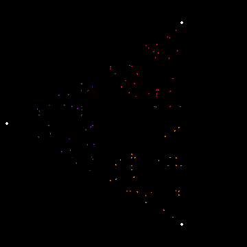
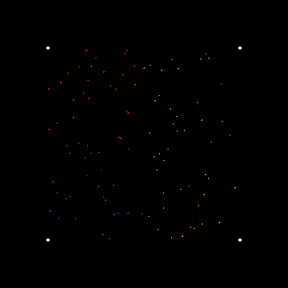

## Visualizations Using [p5py/p5](https://github.com/p5py/p5)

### Install p5

`pip install p5`

### [1. Snowflakes](https://www.youtube.com/watch?v=XUA8UREROYE)

- Brownian Tree Snowflake

`python snowflake/snowflake.py`

<table border="0">
    <tr>
        <td></td>
        <td></td>
    </tr>
</table>

### [2. Toothpick Sequence](https://www.youtube.com/watch?v=-OL_sw2MiYw)

`python fractal-toothpick-sequence/fractal.py`

### [3. Chaos Game](https://www.youtube.com/watch?v=7gNzMtYo9n4&t=612s)

[A Video by Numberphile](https://www.youtube.com/watch?v=kbKtFN71Lfs)

**Rules of the game:**

Given n seed points [x1, x2, x3.....xn] and 1 random starting point C.

1. Randomly choose one of the seed points (uniform probability) say `x``k`:
2. Create a new point at the middle of `C` and `x``k`
3. Call the new point `C` and Repeat from 1.  

`python chaos-game/chaos.py`

**After Several Iterations**

- Each frame of the gif represents 100 iterations of the game.
- Color of point `C` corresponds to the target seed points which was selected for generating `C`.

| With 3 seed points (equilateral Triangle) | 4 seed points (square) | 
|:-----------------------------------------:|:----------------------:|
|||
|We get the Serpinski Triangle :astonished: | No Fractal Pattern |